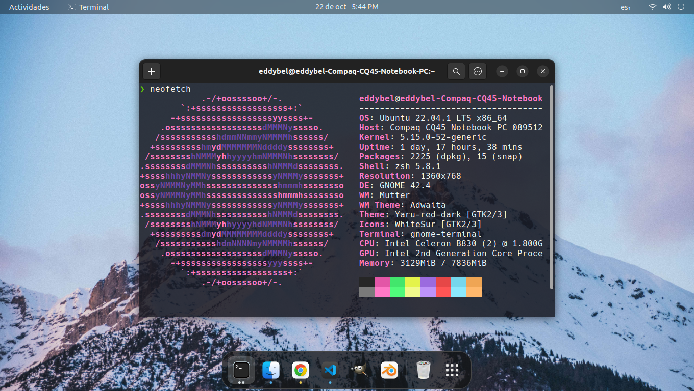

<h1 align="center" >Setup</h1>

Automatización de las instalaciones y programas basicos ejecutando solo un script.

# Paquetes que se instalan

## Apt paquetes

##### Basicos

- Git
- Curl
- Nodejs
- Npm
- Zsh

##### Opcionales

- Blender
- Htop
- Neofetch

## Node paquetes

- n ( Actualizar node js )
- Yarn

## Neovim

- [Configuracion](https://github.com/EddyBel/nvim-configuration)
- [Vim plug](https://github.com/junegunn/vim-plug) ( Gestor de plugins )

## Zsh

- [OhMyZsh](https://ohmyz.sh/)
- [Powerlevel10k](https://github.com/romkatv/powerlevel10k) ( Tema para ohmyzsh )
- [Dracula gnome-terminal](https://draculatheme.com/gnome-terminal) ( Temas del terminal )

# Fuentes

Fuentes descargadas de [Nerd Fonts](https://www.nerdfonts.com/).

- Caskaydia Cove Nerd Font
- CodeNewRoman Nerd Font
- Hack Nerd Font

# Vista resultado

