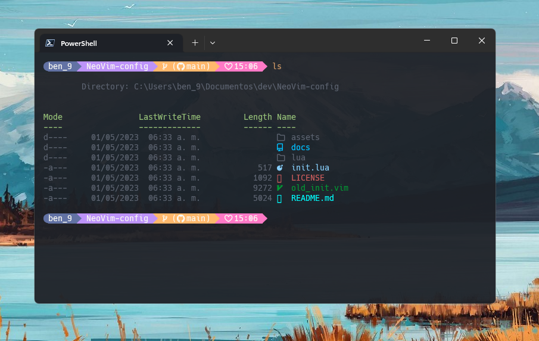

<h1 align="center">Cómo personalizar la terminal de Windows</h1>

<p align="center" >
    
</p>

## Requerimentos

- Es necesario tener alguna fuente de [NerdFonts](https://www.nerdfonts.com/) instalada para poder ver los iconos.

## Instala OhMyPosh

Si te gusta personalizar tu entorno de trabajo, una forma de hacerlo es personalizando la terminal que usas. Con la ayuda de [OhMyPosh](https://ohmyposh.dev/), un programa que funciona de manera similar a zsh, podrás hacerlo de forma sencilla.

OhMyPosh es una herramienta de línea de comandos que mejora la apariencia de la terminal y ofrece una gran cantidad de opciones de personalización. Puedes modificar el estilo de la fuente, el color del texto, el fondo y mucho más. Además, esta herramienta te permite agregar información útil a la línea de comandos, como el nombre del usuario, la hora, la ruta actual y el estado del repositorio de git, entre otros.

Para instalar OhMyPosh en tu máquina con Windows, puedes hacerlo de dos formas: desde la [Microsoft Store](https://apps.microsoft.com/store/detail/XP8K0HKJFRXGCK) o mediante un comando en PowerShell.

Si prefieres la segunda opción, debes abrir PowerShell y escribir el siguiente comando:

```shell
winget install JanDeDobbeleer.OhMyPosh -s winget
```

Este comando descargará e instalará automáticamente la última versión de OhMyPosh en tu sistema.

Después de instalar OhMyPosh en tu sistema Windows, es importante verificar que la instalación se realizó correctamente antes de comenzar a personalizar tu terminal. Para hacerlo, simplemente cierra el terminal y vuelve a abrirlo.

Una vez que hayas abierto la terminal, ejecuta el siguiente comando:

```shell
oh-my-posh get shell
```

Este comando verificará si OhMyPosh está instalado correctamente en tu sistema. Si la instalación se realizó correctamente, deberías obtener la salida **"pwsh"** en la terminal.

Si obtienes la salida **"pwsh"**, significa que OhMyPosh está instalado correctamente y estás listo para comenzar a personalizar tu terminal. Si no obtienes la salida esperada, asegúrate de haber seguido correctamente los pasos de instalación y de que OhMyPosh se haya instalado en la ruta correcta. Si aún así no puedes solucionar el problema, puedes consultar la [documentación de OhMyPosh](https://ohmyposh.dev/docs) o buscar ayuda en foros y comunidades en línea.

## Edita la terminal

Una vez que hayas verificado que OhMyPosh está instalado correctamente en tu sistema, es hora de empezar a personalizar tu terminal. Para hacerlo, necesitarás editar el archivo Microsoft.PowerShell_profile.ps1.

Para encontrar la ubicación de este archivo en tu sistema, puedes usar la variable de entorno $PROFILE. Para hacerlo, abre la terminal y escribe el siguiente comando:

```shell
echo $PROFILE
```

Este comando te mostrará la ruta del archivo Microsoft.PowerShell_profile.ps1 en tu sistema.

Si el archivo no existe, puedes crearlo con el siguiente comando:

```shell
New-Item -Path $PROFILE -Type File -Force
```

Una vez que hayas creado el archivo, puedes editarlo con el editor de texto de tu preferencia, como el bloc de notas o Visual Studio Code. Para abrir el archivo con el bloc de notas, escribe el siguiente comando en la terminal:

```shell
notepad $PROFILE
```

Si prefieres abrir el archivo con Visual Studio Code, escribe el siguiente comando en la terminal:

```shell
code $PROFILE
```

Una vez que hayas abierto el archivo, podrás comenzar a editar la configuración de tu terminal y personalizarla a tu gusto.

Para comenzar a configurar tu shell, abre el archivo **Microsoft.PowerShell_profile.ps1** con el editor de texto de tu preferencia. En este archivo es donde introducirás los comandos que ejecutará la shell.

Para iniciar a probar la vista que tendrá tu shell, puedes escribir en tu archivo **Microsoft.PowerShell_profile.ps1** la siguiente linea:

```shell
oh-my-posh init pwsh | Invoke-Expression
```

Este comando cargará el diseño predeterminado de OhMyPosh y te permitirá ver cómo se verá tu nueva terminal personalizada.

A partir de aquí, puedes comenzar a modificar la configuración de tu terminal a tu gusto, utilizando la documentación de OhMyPosh para crear tus propios temas y personalizar tu shell de acuerdo a tus necesidades y preferencias.

## Instala temas

Una vez que hayas instalado **OhMyPosh** y hayas creado el archivo **Microsoft.PowerShell_profile.ps1**, es hora de instalar los temas para tu terminal personalizada.

Para hacerlo, puedes ejecutar el comando, este comando descargara los temas de OhMyPosh.

```shell
Get-PoshThemes
```

Esto te mostrará una lista de los temas disponibles para OhMyPosh. Elige el que más te guste y toma nota de su nombre.

Para agregar el tema elegido a tu shell, simplemente agrega la siguiente línea de texto al archivo **Microsoft.PowerShell_profile.ps1**:

```shell
oh-my-posh init --shell pwsh --config "$env:POSH_THEMES_PATH\jandedobbeleer.omp.json" | Invoke-Expression
```

Reemplaza **jandedobbeleer.omp.json** con el nombre del tema que elegiste. Esto cargará el tema que elegiste y lo aplicará a tu terminal personalizada.

Con esta simple línea de texto, puedes cambiar el aspecto de tu terminal personalizada en cuestión de segundos, ademas puede ver la lista de temas disponibles en la web https://ohmyposh.dev/docs/themes.

> #### Nota
>
> Recuera que si tienes la linea `oh-my-posh init pwsh | Invoke-Expression` en tu archivo **Microsoft.PowerShell_profile.ps1** debes removerla, Debido a que ya no es necesario que se cargue el tema por defecto.

## Iconos de archivos en PowerShell

Si deseas tener iconos en la lista de archivos de la terminal de Windows PowerShell, puedes utilizar el plugin Terminal-Icons. Para descargarlo, ejecuta el siguiente comando en tu terminal de PowerShell:

```shell
Install-Module -Name Terminal-Icons -Repository PSGallery
```

Una vez que se complete la instalación, agrega la siguiente línea de texto al archivo de configuración Microsoft.PowerShell_profile.ps1:

```shell
Import-Module -Name Terminal-Icons
```

Esto importará el módulo Terminal-Icons en tu sesión de PowerShell y habilitará los iconos para la lista de archivos en la terminal. Ahora, cuando veas la lista de archivos en tu terminal personalizada, verás que cada archivo está acompañado por un icono que lo identifica visualmente.

## Microsoft.PowerShell_profile.ps1

```shell
oh-my-posh init pwsh --config "$env:POSH_THEMES_PATH\dracula.omp.json" | Invoke-Expression
Import-Module -Name Terminal-Icons
```
